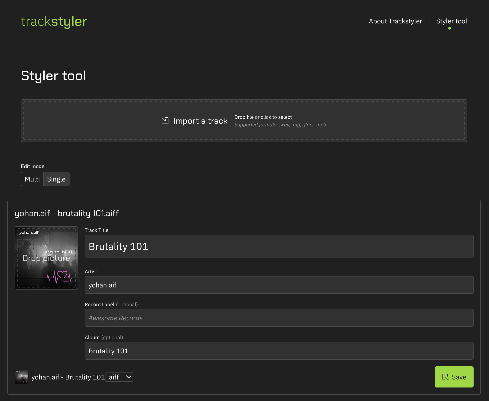

# Trackstyler

Client-side web-based music file tag & format manager, based on [ffmpeg.wasm](https://github.com/ffmpegwasm/ffmpeg.wasm)

Trackstyler is completely free to use - with no fees and no subscriptions. Why? I'm myself a DJ and producer, who simply grew sick of ugly audio files. I'm hoping this tool will reach my favorite artists and help us all.

It's possible because Trackstyler is not too expensive to run - your machine handles the actual processing, which is what would otherwise would make it too pricey to share completely free.

If you like it - please consider supporting my artistic journey on [Instagram](https://instagram.com/yohan.aif) or any music streaming platform - eg. [SoundCloud](https://soundcloud.com/yohandotaif).

## License

This tool is [licensed under AGPL](./license.md) - it can be freely used and modified, but only for free.
